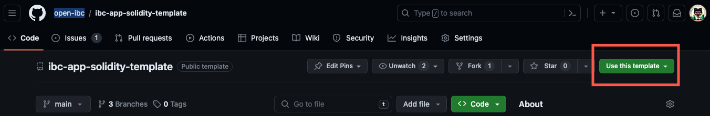

# ⛓️🔗⛓️ Template for IBC enabled Solidity contracts

This repo provides a starter project to build [IBC](https://github.com/cosmos/ibc) enabled Solidity contracts that connect rollups to one another Polymer Hub, through the [vIBC core contracts](https://github.com/open-ibc/vibc-core-smart-contracts).

The repository is a _GitHub template_ repository so you can click "Use this template" to create your own project repository without having the entire commit history of the template.



## 📚 Documentation

There's some basic information here in the README but a more comprehensive documentation can be found in [the official Polymer documentation](https://docs.polymerlabs.org/docs/category/build-ibc-dapps-1).

## 📋 Prerequisites

The repo is **compatible with both Hardhat and Foundry** development environments.

- Have [git](https://git-scm.com/downloads) installed
- Have [node](https://nodejs.org) installed (v18+)
- Have [Foundry](https://book.getfoundry.sh/getting-started/installation) installed (Hardhat will be installed when running `npm install`)
- Have [just](https://just.systems/man/en/chapter_1.html) installed (recommended but not strictly necessary)

You'll need some API keys from third party's:
- [Optimism Sepolia](https://optimism-sepolia.blockscout.com/account/api-key) and [Base Sepolia](https://base-sepolia.blockscout.com/account/api-key) Blockscout Explorer API keys
- Have an [Alchemy API key](https://docs.alchemy.com/docs/alchemy-quickstart-guide) for OP and Base Sepolia

Some basic knowledge of all of these tools is also required, although the details are abstracted away for basic usage.

## 🧰 Install dependencies

To compile your contracts and start testing, make sure that you have all dependencies installed.

From the root directory run:

```bash
just install
```

to install the [vIBC core smart contracts](https://github.com/open-ibc/vibc-core-smart-contracts) as a dependency.

Additionally Hardhat will be installed as a dev dependency with some useful plugins. Check `package.json` for an exhaustive list.

> Note: In case you're experiencing issues with dependencies using the `just install` recipe, check that all prerequisites are correctly installed. If issues persist with forge, try to do the individual dependency installations...

## ⚙️ Set up your environment and configuration

The idea is to ensure that most configuration to add Polymer's vIBC is added as custom data in the configuration file of your development environment, e.g. Hardhat or Foundry. (Note that at the time of writing, only Hardhat is fully supported).

Make sure to add network information to the Hardhat configuration for all supported networks you're interested in building on, following this schema:
```javascript
networks: {
    // for OP testnet
    optimism: {
      url: 'https://sepolia.optimism.io',
      alchemyRPC: `https://opt-sepolia.g.alchemy.com/v2/${process.env.OP_ALCHEMY_API_KEY}`,
      accounts: [process.env.PRIVATE_KEY_1],
      chainId: 11155420,
    }
}
```

Especially make sure the chain ID is added as it will be used to fetch the correct data from the Polymer registry by ID, while you can locally refer to the chain as the name you've specified in the Hardhat config.

### Environment variables

Convert the `.env.example` file into an `.env` file. This will ignore the file for future git commits as well as expose the environment variables. Add your private keys and update the other values if you want to customize (advanced usage feature).

```bash
cp .env.example .env
```

This will enable you to sign transactions with your private key(s). If not added, the scripts from the justfile will fail.

### Configuration file

The configuration file is where all important data is stored for the just commands and automation. We strive to make direct interaction with the config file as little as possible.

By default the configuration file is stored in the config folder as `config.json`.

> 💡 However, it is recommended to split up different contracts/projects in the same repo into different config files in case you want to switch between them.

Store alternate config files in the /config directory and set the path in the Hardhat coniguration file:
```javascript
    // path to configuration file the scripts will use for Polymer's vibc, defaulting to config/config.json when not set
    vibcConfigPath: 'config/alt-config.json',  
```
to use a different config file.

Contrary to previous version, you have to build the default configuration file by specifying the networks (from the Hardhat config) you want it to include:
```sh
# Usage: just build-config SOURCE DESTINATION
just build-config optimism base
```

### Obtaining testnet ETH

The account associated with your private key must have both Base Sepolia and Optimism Sepolia ETH. To obtain the testnet ETH visit:

- [Optimism Sepolia Faucet](https://www.alchemy.com/faucets/optimism-sepolia)
- [Base Sepolia Faucet](https://www.alchemy.com/faucets/base-sepolia)

## 🏃🏽🏃🏻‍♀️ Quickstart

The project comes with a built-in dummy application called x-counter (which syncrhonizes a counter across two contracts on remote chains). You can find the contracts in the `/contracts` directory as XCounterUC.sol and XCounter.sol (the former when using the universal channel, the latter when creating a custom IBC channel).

### Universal channels

The easiest way to get onboarded is to use Universal channels. A universal channel is an IBC channel where the port is owned by Polymer's Universal channel middleware contracts on each chain.

When a user deploys a Universal channel compatible contract (this means inheriting the [UniversalChanIbcApp](./contracts/base/UniversalChanIbcApp.sol) base contract), it will be able to connect to the Universal Channel middleware, define Universal packets which will then be wrapped into an IBC packet by the Universal Channel Handler and unwrapped by its counterpart on the destination chain (rollup). The Universal channel middleware on the destination will then unwrap the IBC packet and send the data through to you application on the destination.

Find out more about uinversal channels in the [documenation](https://docs.polymerlabs.org/docs/build/ibc-solidity/universal-channel).

The configuration file that comes as default in the template repository, allows to quickly send a packet by running:

```sh
just send-packet base
```

To send a packet between the XCounterUC contract on Base Sepolia to OP Sepolia and vice versa.

You can find the universal channel middleware details [in the documentation](https://docs.polymerlabs.org/docs/build/supp-networks).

Check if the packet got through on the [Polymer IBC explorer](https://sepolia.polymer.zone/packets).

### Custom IBC channel

There's also a just recipe that quickly enables to try to send packets over a custom IBC channel. Custom IBC channel require a channel hanshake to open a private IBC channel (which can take a while depending on the client latency) but then give complete control over a private IBC channel that enables fault isolation from other applications, compared to unviersal channels.

To have your application be compatible with custom IBC channels, have it inherit the [CustomChanIbcApp](./contracts/base/CustomChanIbcApp.sol) base contract.

Run the following command to go through a full E2E sweep of the project, using the default XCounter.sol contract:

```bash
# Usage: just do-it
just do-it
```

It does the following under the hood:
```bash
# Run the full E2E flow by setting the contracts, deploying them, creating a channel, and sending a packet
# Usage: just do-it
do-it:
    echo "Running the full E2E flow..."
    just set-contracts optimism XCounter false && just set-contracts base XCounter false
    just deploy optimism base
    just create-channel
    just send-packet optimism
    echo "You've done it!"
```

It makes sure you've got the correct contracts set, deploys new instances, creates a channel and sends a packet over the channel once created.

> Note: by default the sim-client is used to improve latency. This is useful for iterative development and testing BUT also insecure as it involves no proofs. Make sure to move to the client **with proofs** by running another just command...

```bash
# Usage: just switch-client
just switch-client
```

Check if the packet got through on the [Polymer IBC explorer](https://sepolia.polymer.zone/packets).


## 💻 Develop your custom application

The main work for you as a developer is to develop the contracts that make up your cross-chain logic.

You can use the contracts in the "/contracts/base" directory as base contracts for creating IBC enabled contracts that can either send packets over the universal channel or create their own channel to send packets over.

A complete walkthrough on how to develop these contracts is provided in the [official Polymer documentation](https://docs.polymerlabs.org/docs/build/ibc-solidity/).

## 🕹️ Interaction with the contracts

When the contracts are ready, you can go ahead and interact with the contracts through scripts. There is a Justfile to for the most common commands, with the underlying scripts in the /scripts folder.

The `/private` folder within the scripts folder has scripts that you're unlikely to need to touch. The only scripts you'll (potentially) be interacting with are:

There's three types of default scripts in the project:

- The `deploy.js` allows you to deploy your application contract. You may want to add additional deployment logic to the Hardhat script.
- In the `/contracts` folder you'll find `arguments.js` to add your custom constructor arguments for automated deployment with the `deploy.js` script.
- The `send-packet.js` script sends packets over an existing custom channel, and `send-universal-packet.js` is specifically for sending packets over a universal channel. You might want to add additional logic before or after sending the packet to cusotmize your application.

For most of the actions above and more, there are just recipes that combine related logic and update the configuation file in an automated way.

> **Note**: These are the default scripts provided. They provide the most generic interactions with the contracts to deploy, create channels and send packets. For more complicated use cases you will want to customize the scripts to your use case. See [advanced usage](#🦾-advanced-usage) for more info.

### Deploy

Before deploying, make sure to update the config.json with your contract type to deploy for each of the chain you wish to deploy to.

#### Set contracts to config

Do this by running:

```bash
# Usage: just set-contracts [chain] [contract_type] [universal]
just set-contracts optimism MyContract true
```

to deploy _MyContract_ artefact to the Optimism (Sepolia) chain.

> **IMPORTANT**: This is where you set if your contract uses universal or custom channels. Make sure this corresponds to the base contract you've inherited from when developing your application (UniversalChanIbcApp or CustomChanIbcApp).

#### Constructor arguments

By default any application inheriting a base IBC application contract will need a dispatcher or universal channel handler address passed into the constructor. Obviously you might have other constructor arguments you may want to add. To still make use of the `just deploy source destination` recipe, add your arguments to the arguments.js file

```javascript title="/contracts/arguments.js"
module.exports = {
    "XCounter": [],
    "XCounterUC": [],
    // Add your contract types here, along with the list of custom constructor arguments
    // DO NOT ADD THE DISPATCHER OR UNIVERSAL CHANNEL HANDLER ADDRESSES HERE!!!
    // These will be added in the deploy script at $ROOT/scripts/deploy.js
};
```

#### Finally: deploy

Then run:

```bash
# Usage: just deploy [source] [destination]
just deploy optimism base
```

where the script will automatically detect whether you are using custom or universal IBC channels.

The script will take the output of the deployment and update the config file with all the relevant information.

Before moving on, you'll want to check if the variables in your .env and config files line up with what is stored in the actual deployed contracts... especially when you're actively playing around with different configuration files and contracts.

To do a sanity check, run:
```bash
# Usage: just sanity-check
just sanity-check
```

### Create a channel

If you're **using universal channels, channel creation is not required**. Your contract will send and receive packet data from the Universal channel handler contract which already has a universal channel to send packets over. You can directly proceed to sending (universal) packets in that case.

To create a custom channel, run:

```bash
just create-channel
```

This creates a channel between base and optimism. Note that the **ORDER MATTERS**; if you picked optimism as the source chain (first argument) above, by default it will create the channel from optimism and vice versa.

The script will take the output of the channel creation and update the config file with all the relevant information.

Check out the [channel tab in the explorer](https://sepolia.polymer.zone/channels) to find out if the correct channel-id's related to your contracts were updated in the config.

### Send packets

Finally Run:

```bash
# Usage: just send-packet
just send-packet optimism 
```

to send a packet over a channel (script looks at the config's isUniversal flag to know if it should use the custom or universal packet). You can pick either optimism or base to send the packet from.

## Verify, don't trust

As a starter value, the sim-client is used to improve latency. **The sim-client is useful for iterative development and testing BUT also insecure as it involves no proofs**. Make sure to move to the client **with proofs** by setting the `proofsEnabled` flag in the config file to true:

```json
// In config/proof-config.json
{
    ...,
    "proofsEnabled": true,
    ...
}
```


This will use the op-stack client with proofs, making sure that the relayer is proving what is being submitted every step along the way, ensuring there's no trust assumption on the relayer.

## 🤝 Contributing

We welcome and encourage contributions from our community! Here’s how you can contribute.

Take a look at the open issues. If there's an issue that has the _help wanted_ label or _good first issue_, those are up for grabs. Assign yourself to the issue so people know you're working on it.

Alternatively you can open an issue for a new idea or piece of feedback.

When you want to contribute code, please follow these steps:

1. **Fork the Repository:** Start by forking this repository.
2. **Apply the improvements:** Want to optimize something or add support for additional developer tooling? Add your changes!
3. **Create a Pull Request:** Once you're ready and have tested your added code, submit a PR to the repo and we'll review as soon as possible.

## 💡 Questions or Suggestions?

Feel free to open an issue for questions, suggestions, or discussions related to this repository. For further discussion as well as a showcase of some community projects, check out the [Polymer developer forum](https://forum.polymerlabs.org).

Thank you for being a part of our community!
